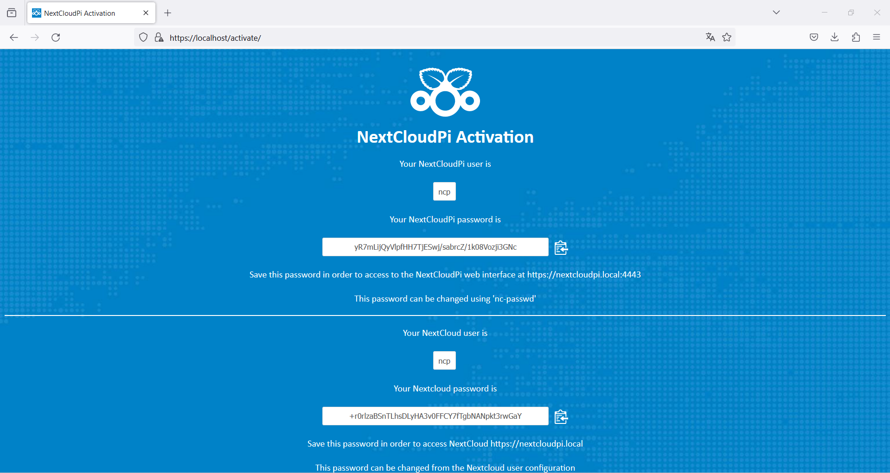
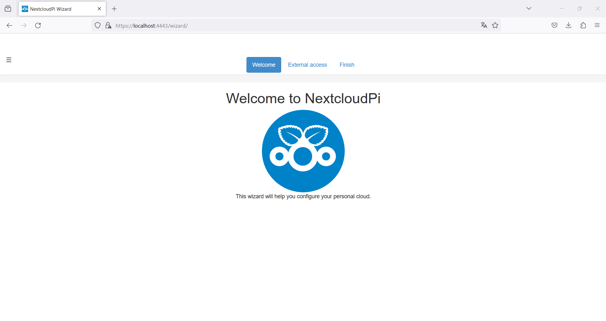
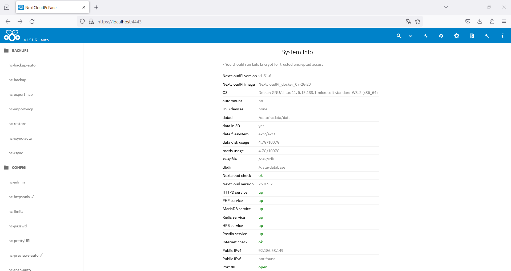

>**Prerequisitos**
> - Raspberry 3B+ o superior
> - Conocimientos básicos de Linux 😁
> - [Balena etcher](https://etcher.balena.io/#download-etcher)

## Descargar la imagen y flashear

1.  [Descargar la imagen de Nextcloud](https://github.com/nextcloud/nextcloudpi/releases/download/v1.53.0/NextCloudPi_LXC_arm64_v1.53.0.tar.gz)
2. Flashear imagen con balena etcher
3. Conectar la tarjeta a la raspi.
4. Iniciar raspberry e introducir los datos que nos pide.


## Activación

La primera vez que accedemos a ella [https://ip_raspberry.local](https://nextcloud.local) nos encontramos con lo siguiente.




Como podemos ver por defecto el usuario es "ncp" tanto para la parte de administración como para la parte usuario.

Nos lo guardamos a buen recaudo. Aunque mediante la consola de la raspberry en caso necesario de cambiar la contrasñea podemos ejecutar ```nc-passwd```

Una vez memorizados los dos usuarios y contraseñas, pulsamos en el botón __Activate__ (Tardará unos minutos. Depende la raspi que estés usando).


### Configuraciones iniciales

Una vez activado nos habrá redirigido al puerto __4443__

Nos pedirá autenticarnos asi que usamos el usuario __ncp__ y su respectiva contraseña.

Ejecutamos el wizard.


Y ya tenemos panel de administración


