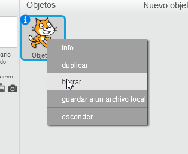
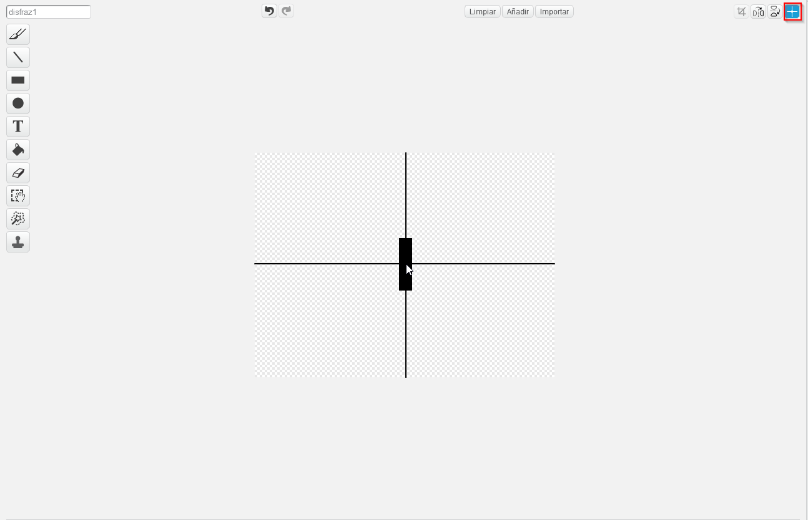
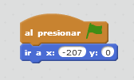
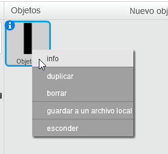
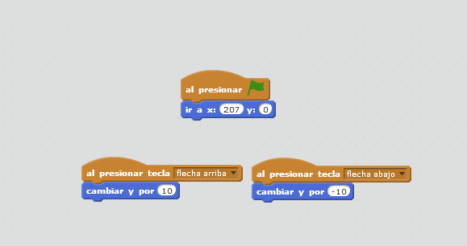
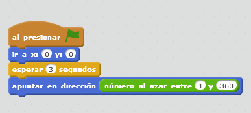
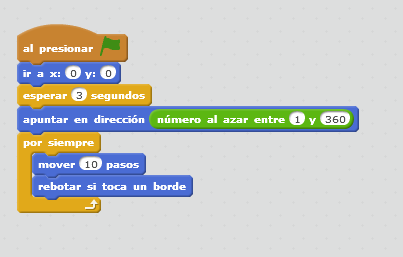
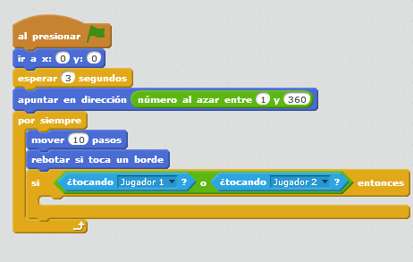
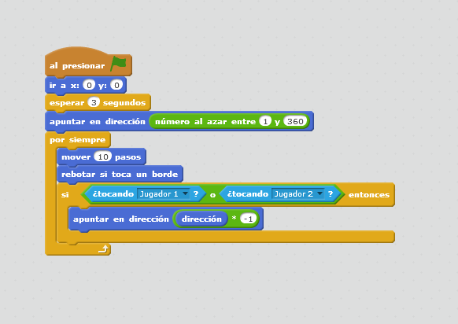
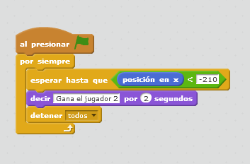

**Prerequisitos**
Trabajaremos sobre Scratch 2

## Eliminando el Sprite que viene por defecto (El gato)

<!--  -->

## Dibujando los objetos
Pinchamos sobre el lápiz y se nos abrira la seccion de disfraces

<!--  -->

Sería una barra asi que seleccionamos el icono rectangulo y lo rellenamos de negro

<!--  -->

## Fijando el centro

<!--  -->
Pinchando en el icono superior derecho nos apareceran unas guias y pinchamos en el centro de nuestra barra, de esa forma fijaremos cual es el centro de nuestra figura

## Dando vida
Una vez hemos seleccionado el centro, nos vamos a la seccion programas para comenzar a dar vida a nuestro rectangulo.

## Indicando la posicion inicial
Para ello, seleccionamos la pestaña de _Eventos_ y seleccionamos el bloque de la banderita verde, en la seccion de _movimiento_ seleccionamos el bloque que dice _ir a x:-216 y: 12_
Como podemos ver, los numeros no tienen por que ser los que digo antes, asi que los cambiaremos para que sean en el _eje x: -207 y en el eje y: 0_

<!--  -->

## Eventos de teclado
Como esta barra sera para el jugador 1 vamos a seleccionar dos teclas las cuales sean subir y bajar, para ello nos vamos a _eventos_ seleccionamos _Al presionar una tecla_ y elegimos una tecla, por ejemplo la W y añadimos el bloque que esta en _movimiento_ que dice _sumar a y 10_
Duplicamos esos bloques cambiando la letra por S y cambiamos el 10 por -10

<!--  -->

Si hacemos la prueba, podremos ver que ya tenemos el movimiento para la barra tanto subir como bajar

## Cambiando el nombre al objeto
Para poder diferenciar las barras, vamos a cambiarle el nombre al Objeto 1, para ello hacemos click derecho sobre él y pulsamos en _info_

<!--  -->

En mi caso le he llamado _Jugador 1_, duplicamos el objeto y le llamamos Jugador 2, hacemos los cambios necesarios para que se coloque automaticamente a la derecha de la pantalla y se mueva con las flechas arriba y abajo

<!--  -->

Deberia de quedarnos algo asi

## Generando el 3º Sprite

Hacemos los pasos anteriores pero en vez de dibujar un rectangulo haremos un circulo

> **Tip** Si pulsamos la tecla _Shift_ mientras dibujamos el circulo nos aseguramos que sea perfectamente un circulo.

## Fijando el centro

**IMPORTANTE** En este caso estamos jugando con los giros del objeto lo cual es necesario hacerlo.

Para ello seguimos los pasos que hicimos con el rectangulo

## Cambiando el nombre

Para reconocerlo de una forma facil asignamos el nombre _bola_

## Programando la bola

Le asignamos un lugar inicial siendo el centro de la pantalla

<!--  -->

## Asignando un tiempo de espera

Le damos un tiempo de espera para que los jugadores puedan ponerse manos al teclado, para ello nos vamos a la pestaña _Control_ y seleccionamos la opcion que dice _esperar x segundos_ en mi caso le he asignado 3 segundos

<!--  -->

## Asignando el comienzo de forma aleatoria

No queremos que siempre vaya hacia el mismo lado ya que si no, seria una gran ventaja para el otro jugador, para ello haremos lo siguiente:

Seleccionamos desde la seccion _movimiento_ el bloque que dice _apuntar en direccion X_ despues, nos vamos a la seccion operadores y elegimos el bloque que dice _numero al azar entre 1 y 10_

<!--  -->

## Dando movimiento a la bola

<!--  -->

Vamos a añadir los siguentes bloques para que la bola se este moviendo continuamente y que si toca un borde rebote

## Rebotar si toca contra un jugador
Para ello veremos el condicional Si para preguntar si esta tocando el jugador 1 o al 2.

Usaremos el operador _o_ y la opcion de los sensores que dice _¿tocando puntero del raton?_
<!--  -->

Como queremos cambiar en direccion contraria, para ello vamos a multiplicar la direccion actual por -1

<!--  -->

Si ahora ejecutamos el juego podremos ver que ya rebota cuando le pulsamos, pero nos falta que cuando toque el borde izquierdo o el derecho pierda.

## Finalizando el juego
Cuando no hemos dado a la bola y toca uno de los bordes de los laterales queremos que se pare el juego, asi que vamos a programar esa seccion

<!--  -->
<!--  -->

Con estos dos bloques estamos haciendo que cuando llegue a uno de los laterales diga quien gana y se pare el programa.

